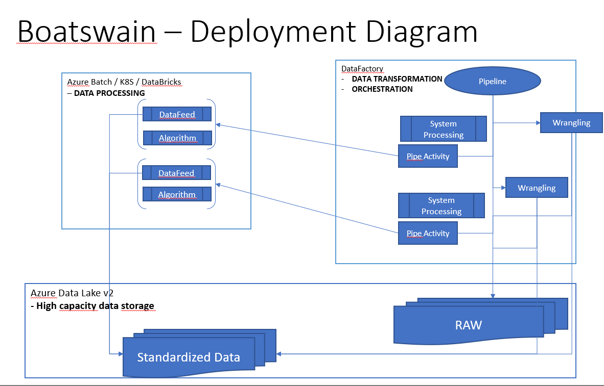
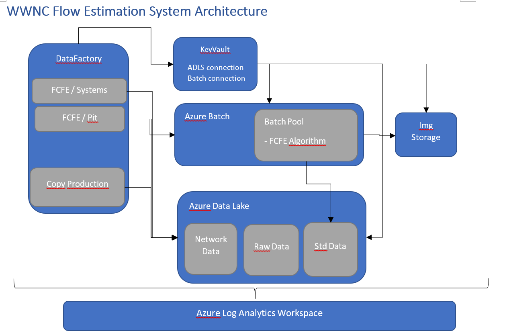

# Summary

Boatswains were junior officers. They were people who supervised all activities on a ship. Depending on the size of the ship and crew, they could have one or several duties. Duties ranged from anchoring to naval provisions. They reported to the Quartermaster or the Captain.

The same applies for this analytics project. The aim is to provide a platform where Data Engineers can schedule and monitor their analytics. Its responsibility is therefor to supervise all analytic activites in the execution environment and make sure things go smoothly.

At the moment, the project targets Waste Water Network solutions, specifically the Flow Estimation algorithm. Through simple extensions however (like a new execution environment or a different orchestration tool), other project can be on-boarded to this solution.

# System Concepts and Deployment Diagram

<>

The image above illustrates the high level components of the solution, and the technologies proposed to run them. These are split, based on their purpose, in four main areas:
1. __Data Processing__: the core data processing and analytics logic captured by the analytics _Algorithm_, together with a thin layer for getting the required data out of the data storage (_DataFeed_). These components run inside an execution environment, which can be _Azure Batch_, _Kubernetes_ or _DataBricks_.
2. __Data Transformation__ : The logic to manipulate data, and prepare it for the algorithm's requirements. This includes activities such as _System Processing_ (going through the components of a system, like pits) and _Wrangling_ (changing the data schema to correspond to that required by the algorithm). The proposed technology (at the moment) for running these components is _Data Factory_
3. __Data Storage__: High capacity and availability storage is required to persist the data between different stages of the data pipeline: going from 1) _Raw Data_ to 2) _Standardized Data_. The _Azure Data Lake v2_ is used for these activities.
4. __Orchestration__: The data pipeline requires overall synchronization and sequencing of activities. The _Pipeline_ component is used, together with _Pipe Activities_ to ensure that the individual steps of the pipeline are executed in order. Again, _DataFactory_ is a good tool to use for these activities. If more complex orchestration is needed (for activities not supported by Data Factory), then _Azure Automation_ is also a valid candidate for these steps.

For more details, please see the [Boatswain Architectural Solution]{} document.

# Flow Calibration and Estimation System Architecture
The system architecture for the Flow Calibration and Estimation (FCFE) is presented bellow:

<>

There are four main components inside the system:
1. _Data Factory_ for orchestrating the overall _FCFE Systems Pipeline_, which processes the WWNC systems, and invokes _FCFE Pit Pipeline_. There is also an extra pipeline responsible for copying production data into the data store (we are currently inside the development environment).
_Note_: The pipelines themselves are not part of this repository, and are managed separately.

2. _Key Vault_ for keeping all the connection strings for the services used by data factory.  The key vault values are populated during infrastructure deployment, as this is the point when these are known.

3. _Azure Batch Service and Pool_ represents the execution environment. The Flow Calibration and Estimation algorithm is deployed here as an application, and invoked from DF (or manual).

4. _Azure Data Lake_ is the cold data file based storage used for storing the raw data, network information and standardized data.

There are other two components involved in this architecture:
* the _Image Storage_ which is required by the batch account to store images for the virtual machines managed through the batch pool
* the monitoring layer consisting of the _Azure Log Analytics Workspace_

# Infrastructure as Code deployment

The _infrastructure_ folder inside this repo contains the Terraform code used to deploy the Boatswain solution inside our environments (Dev, Test, QA, Production). This code is contained in the [main.tf](Infrastructure/main.tf).
The [variables.tf](Infrastructure/variables.tf) file is used to provide runtime values to the variables required by Terraform, and the [tf-deploy.ps1](Infrastructure/tf-deploy.ps1) file contains the deployment script.
The important thing to mention here is that we are using TF to link all the above services together through the Key Vault. The [main.tf](Infrastructure/main.tf) infrastructure stack provisions this Key Vault and creates the necessary secrets inside for the connection strings. These are then consumed by the Data Factory pipelines to make the service connections required. 

The infrastructure deployment pipeline ([azure-pipelines.yml](azure-pipelines.yml) and support template [bswain-pipe-template.yaml](bswain-pipe-template.yaml)) is as follows:
1. get the connection secrets for WWNC Raw Data Storage (required to access the raw data) and the Azure Data Lake (cold path storage for network, raw and standardized data). Note that these connection are different between environments, and it is not necessary for the ADLS to be managed together with the rest of the infrastructure.

2. Invoke the deployment script. This does not do much except gather some information about the environment it's suppose to deploy to (based on the configuration in the pipeline), and then generate the variables and backend configuration files. __NOTE__ For now we need to pass the variables and backend configuration as files to the Terraform Remote Backend, otherwise TF complains, and we could not figure out something better.

At the end, the TF code is invoked and the infrastructure stack is deployed to the specified environment.

# Resources
* Azure Batch:
* Docker:
* DataBricks:
* DataFactory:
* Azure Data Lake: